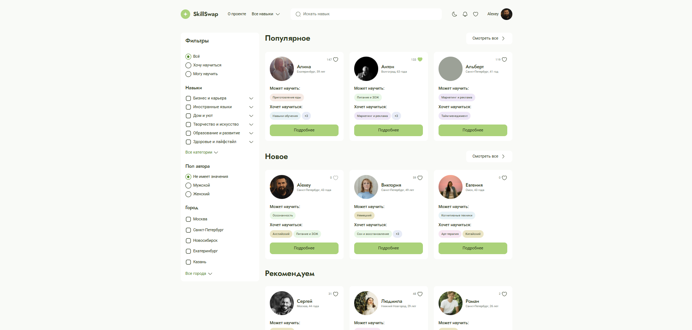
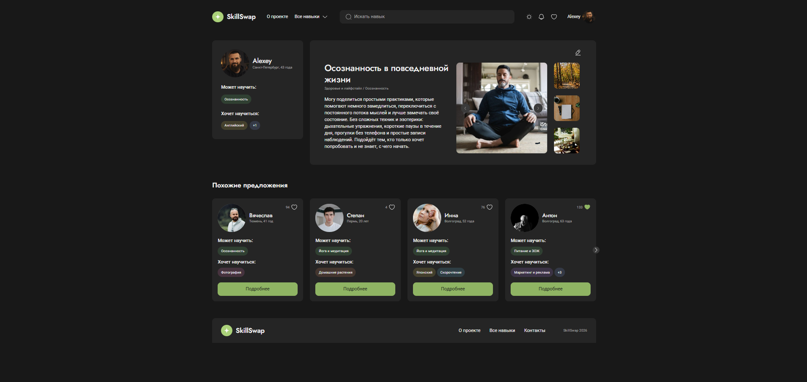
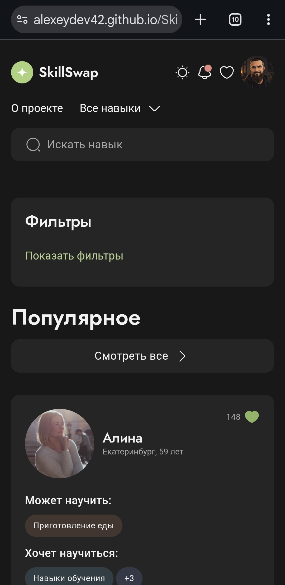
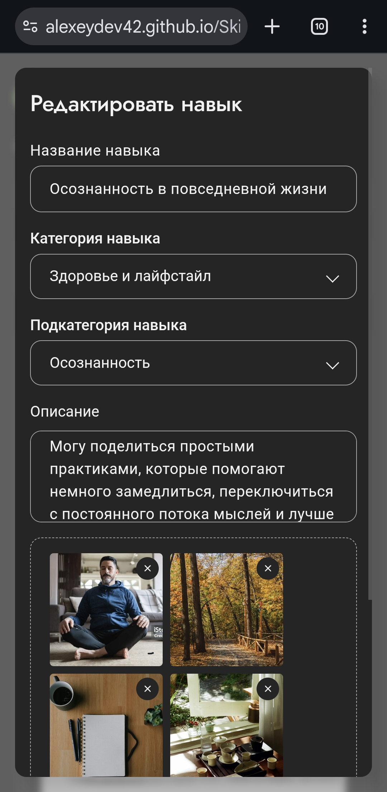

# SkillSwap

SkillSwap is a web application for exchanging skills. Users can browse other people’s offers, save interesting profiles to favorites and propose a mutual skill exchange.

The project was developed by a student team as the final project of the Yandex Practicum Frontend Developer program.

**Live Demo:** [alexeydev42.github.io/SkillSwap_55_3](https://alexeydev42.github.io/SkillSwap_55_3/)

## Screenshots

<p align="center">
  <a href="docs/screenshots/catalog-desktop.png">
    
  </a>

  <a href="docs/screenshots/skill-page-dark.png">
    
  </a>
</p>

<p align="center">
  <a href="docs/screenshots/catalog-mobile.jpg">
    
  </a>

  <a href="docs/screenshots/edit-skill-mobile.jpg">
    
  </a>
</p>

## My contribution

I worked on the original team project as an assistant team lead and frontend developer.

During the team phase, my contribution included frontend implementation and application logic across the shared codebase, including catalog behavior, reusable UI, routing, Redux-based state synchronization and user flows.

### Independent work after the team project

After the team project was completed, I continued developing this fork independently. The changes below were implemented by me after the team phase and are not presented as team work:

- deployed the application to GitHub Pages and added a CI-based deployment workflow;
- switched routing to `HashRouter` so direct page refresh works correctly on GitHub Pages;
- fixed production asset paths for user avatars and skill images;
- added responsive layouts for desktop, tablet and mobile;
- added light and dark themes with persisted manual theme selection;
- improved accessibility of interactive controls, forms, modals and expandable UI;
- completed a production smoke-test pass and fixed issues found during it;
- added editing of the local user’s published skill, including validation and storage rollback behavior;
- fixed Header search so a query entered on internal pages opens the catalog with the search already applied;
- removed the duplicate native browser clear control from the search input;
- fixed the mobile Contacts layout;
- replaced the raw lazy-route loading text with the shared Spinner loading state;
- added and updated regression tests for the new behavior.

## Key features

- user catalog with search, filters and sorting;
- “Popular”, “New” and “Recommended” sections;
- favorites with synchronized like counts;
- skill details and similar offers;
- editing of the local user’s published skill;
- three-step local registration;
- local authentication, session restoration and protected routes;
- profile editing and password changes;
- exchange requests and notifications;
- responsive layouts for desktop, tablet and mobile;
- light and dark themes.

## Technical decisions

Redux Toolkit is used as the main source of application state. Favorites, like counts, profile data, requests, notifications and catalog parameters are synchronized through Redux and selectors.

Protected routes preserve the originally requested URL and return the user to it after successful authentication.

The application restores local user data, session state, requests and notifications after a page reload. Catalog filters and sorting are kept in `sessionStorage`, while longer-lived local data is stored in `localStorage`.

The “Recommended” section uses a one-time shuffled user list and imitates incremental loading. Similar offers are selected first by subcategory and then by the broader skill category.

For the portfolio deployment, the fork uses `HashRouter` so direct route refresh works correctly on GitHub Pages.

## Tech stack

- React 18
- TypeScript
- Redux Toolkit
- React Router
- React Hook Form
- Yup
- CSS Modules
- Vite
- Vitest
- Testing Library
- Storybook
- ESLint, Stylelint and Prettier

## Architecture

The project is organized by layers and domain areas:

```text
src/
├── api/          # loading mock data
├── app/          # providers, routing and global styles
├── entities/     # user, skill and request entities
├── integration/  # integration tests
├── pages/        # application pages
├── shared/       # types, configuration, utilities and reusable UI
├── store/        # Redux store, slices, selectors, thunks and middleware
└── widgets/      # larger interface blocks
```

Presentational components receive data through props, while pages and containers connect them to Redux and routing. Local component state is used for interface behavior such as menus, modals and carousels.

## Testing and CI

The project includes unit and integration tests built with Vitest and Testing Library. They cover Redux logic, selectors, components and user flows such as registration, authentication, state restoration, profile editing, skill editing, favorites, requests, notifications and search navigation.

GitHub Actions runs linting, TypeScript checks, tests and the production build for pull requests to `develop` and changes in `main` and `develop`.

The portfolio fork is also deployed to GitHub Pages through CI.

## Run locally

Node.js 20+ and npm are required.

```bash
npm install
npm run dev
```

The development server is available at [http://localhost:5173](http://localhost:5173).

Useful commands:

```bash
npm run lint
npm run test
npm run build
npm run storybook
```

## Project limitations

This is a frontend-only educational MVP without a backend. The application uses local JSON data and browser storage. Authentication, requests, notifications and other persisted user data demonstrate client-side behavior rather than production data storage.

## Team

| Member | Role | GitHub |
| --- | --- | --- |
| Daria Andreeva | Team lead | [DariAndreeva](https://github.com/DariAndreeva) |
| Oleg Bolyukh | Frontend developer | [Jonk25](https://github.com/Jonk25) |
| Albert Valeev | Frontend developer | [albertthecreature](https://github.com/albertthecreature) |
| Arkadii Galchenko | Frontend developer | [Arkadii233](https://github.com/Arkadii233) |
| Yulia Deltsova | Frontend developer | [JulieDelts](https://github.com/JulieDelts) |
| Anastasia Koroleva | Frontend developer | [AnastasiaK92](https://github.com/AnastasiaK92) |
| Mikhail Maksimenko | Frontend developer | [maksimenkomv](https://github.com/maksimenkomv) |
| Egor Smirnov | Frontend developer | [kurumi177](https://github.com/kurumi177) |
| Alyona Smirnova | Frontend developer | [wruqlwx](https://github.com/wruqlwx) |
| Alexey Surkov | Assistant team lead | [alexeydev42](https://github.com/alexeydev42) |
